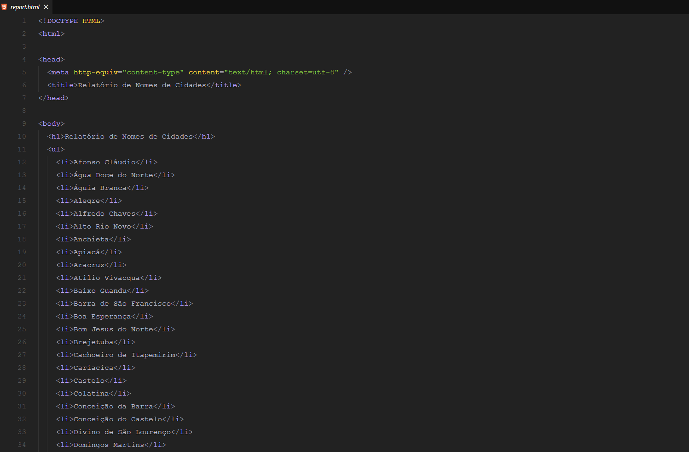
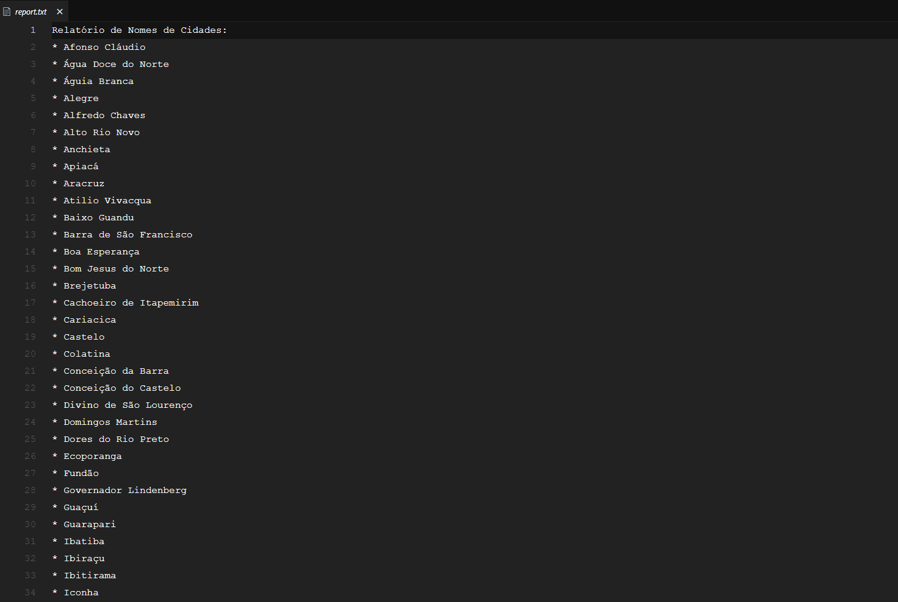

# Documentação do Projeto
##Padrão Criacional utilizado: Factory Method
O Factory Method fornece uma interface para criar objetos em uma superclasse, permitindo que as subclasses alterem o tipo de objetos que serão criados. Este padrão promove a reutilização de código, facilitando a criação de objetos sem especificar a classe exata a ser instanciada. No projeto, a classe ReportFactory implementa o Factory Method. Ela possui um método createReport que cria e retorna instâncias de HTMLReport ou TXTReport com base no tipo de relatório especificado.

##Padrão Estrutural utilizado: Adapter
O Adapter permite que interfaces incompatíveis trabalhem juntas. Ele atua como um conversor, adaptando a interface de uma classe para que possa ser utilizada por uma classe que espera uma interface diferente. Embora não haja uma classe Adapter explícita no projeto, a implementação do padrão Strategy (explicada a seguir) atua de forma semelhante ao adaptar a estrutura dos dados para diferentes formatos de relatório.

##Padrão Comportamental utilizado: Strategy
O Strategy define uma família de algoritmos, encapsula cada um deles e os torna intercambiáveis. O Strategy permite que o algoritmo varie independentemente dos clientes que o utilizam. A classe ReportStrategy implementa o padrão Strategy. Ela aceita um objeto de relatório (HTML ou TXT) e delega a geração e salvamento do relatório para o objeto especificado.

##Refatorações com Base nos Princípios SOLID
  1. Single Responsibility Principle (SRP): Cada classe (HTMLReport e TXTReport) é responsável apenas pela geração e salvamento de relatórios em seus respectivos formatos, promovendo uma clara separação de responsabilidades.
  2. Open/Closed Principle (OCP):O sistema está aberto para extensão de novos tipos e fechado para modificação (a lógica existente não precisa ser alterada para adicionar novos relatórios), facilitando a expansão do sistema sem comprometer a estabilidade do código existente.
  3. Dependency Inversion Principle (DIP): Utilizando o padrão Strategy, a dependência está invertida, onde a classe de alto nível (ReportStrategy) depende de uma abstração (interface de relatório), e não de classes concretas, promovendo maior flexibilidade e reutilização de código.

##Como testar o código

Clone o repositório

Instale as dependências
```bash
npm install
```
Após a instalação das dependências, use o seguinte comando:
```bash
node index.js
```
O comando irá criar 2 arquivos, report.html e report.txt. Ao abrir os arquivos, vamos ter os seguintes resultados:

html:



txt:


